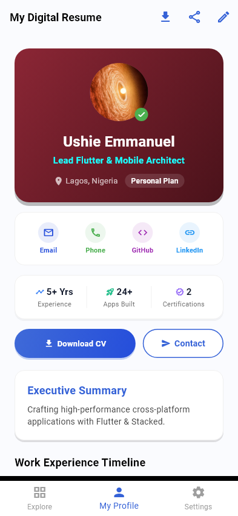
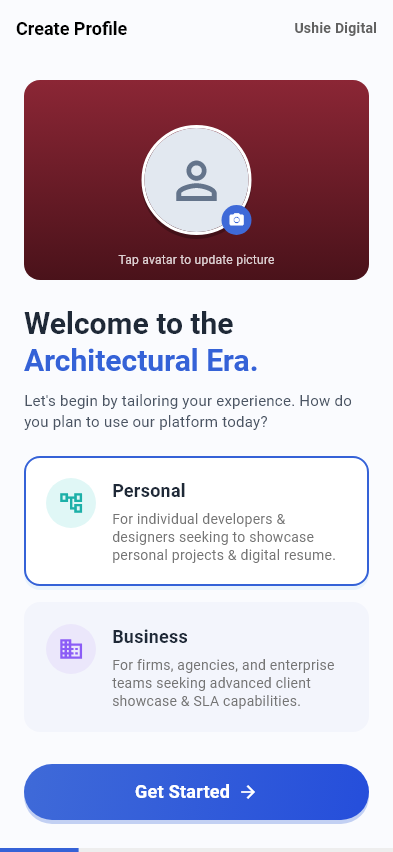
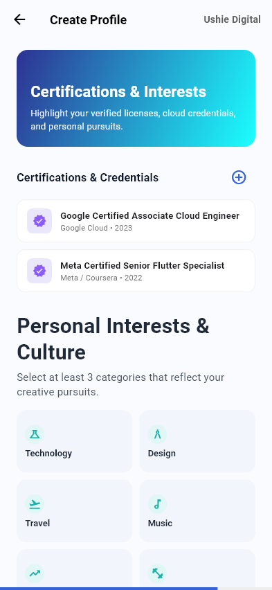
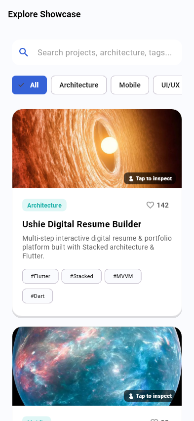

# Ushie Digital Resume

[](https://flutter.dev)
[](https://stacked.filledstacks.com)
[](https://supabase.com)
[](LICENSE)

**Ushie Digital Resume** is an all-in-one developer resume, executive consultancy showcase, and enterprise digital studio platform built with **Flutter**, **Stacked MVVM**, and **Supabase**.

It combines dynamic personal developer resumes, executive consultancy portfolios, enterprise design studio directories, and high-performance mobile features into a unified cross-platform application.

---

## 🌟 Key Product Features

- **Personal Developer Resume**: Dynamic skills matrix, bio, project portfolio, and curated interests.
- **Executive Consultancy & Agency Showcase**: Team size, company overview, target industry sectors, enterprise capabilities, and SLA support specs.
- **Ushie Digital Brand Studio**: Asset cards (`SCREEN_14`, `SCREEN_2`, `SCREEN_10`, `SCREEN_9`), visual compliance indicator (75%), and brand asset export actions.
- **1-Tap Account Login System**: Instant profile access for registered personal (`Ushie Emmanuel`) & business (`Ushie Tech Labs`) accounts.
- **Supabase Cloud Backend (`supabase_flutter 2.17.2`)**: Real-time authentication, profiles database sync, and project showcase storage.
- **Multi-Platform Support**: Configured for both **Android** and **iOS** native builds.

---

## 📱 App Showcase & UI View Gallery



<table width="100%">
  <tr>
    <td align="center" width="50%">
      <br/>
      <b>View 1: Onboarding Plan Selection (<code>OnboardingView</code>)</b><br/>
      <sub>Personal vs. Business setup, 1-Tap Login trigger, and floating paste tooltip.</sub><br/><br/>
      <br/>
      <b>Screen 1: Spatial Serenity & Profile Hero</b><br/>
      <sub>Primary background asset and initial profile hero card.</sub>
    </td>
    <td align="center" width="50%">
      <br/>
      <b>View 2: Target Markets & Interests (<code>OnboardingView</code>)</b><br/>
      <sub>Curated interests grid for personal developers & target market selection for firms.</sub><br/><br/>
      <br/>
      <b>Screen 2: Organic Rhythm & Business Setup</b><br/>
      <sub>Background layering component for onboarding focus areas.</sub>
    </td>
  </tr>
  <tr>
    <td align="center" width="50%">
      <br/>
      <b>View 3: Explore Showcase (<code>ExploreView</code>)</b><br/>
      <sub>Search query bar, horizontal category filter chips, and project cards.</sub><br/><br/>
      <br/>
      <b>Screen 3: Structural Clarity & Finalization</b><br/>
      <sub>Header image component for the final review phase.</sub>
    </td>
    <td align="center" width="50%">
      <br/>
      <b>View 4: Main Profile Dashboard (<code>HomeView</code>)</b><br/>
      <sub>User avatar, skills summary, interest chips, and bottom navigation bar.</sub><br/><br/>
      <br/>
      <b>Screen 4: Multi-Tab Dashboard</b><br/>
      <sub>My Profile, Explore Showcase, category filtering, and Settings preferences.</sub>
    </td>
  </tr>
</table>

---

## 🚀 Live Web & Simulator Preview (Appetize)

Test **Ushie Digital Resume** live in your browser:

👉 **[Launch Appetize Interactive Live Simulator](https://appetize.io/app/demo-ushie-digital-resume)**

---

## 🛠️ Build & Flavor Configurations

- **Dev Environment**: `flutter run -t lib/main_dev.dart --flavor dev`
- **Prod Environment**: `flutter run -t lib/main_prod.dart --flavor prod`

---

## 🧪 Quality Assurance & Test Verification

```bash
# Run Static Code Analysis
flutter analyze

# Run Automated Test Suite & Goldens
flutter test
```
