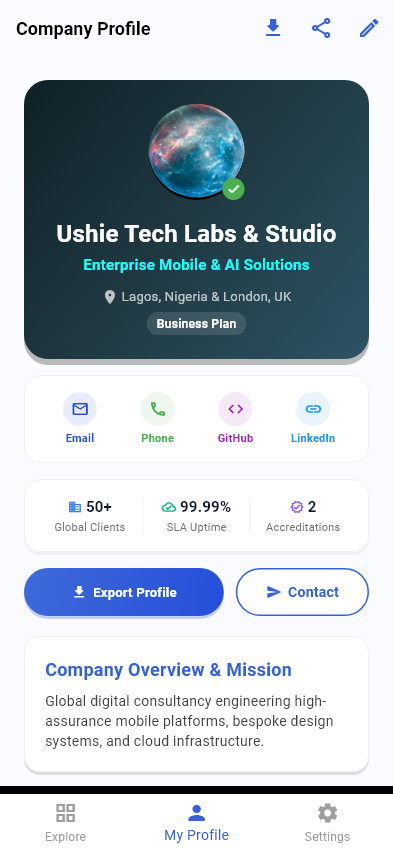
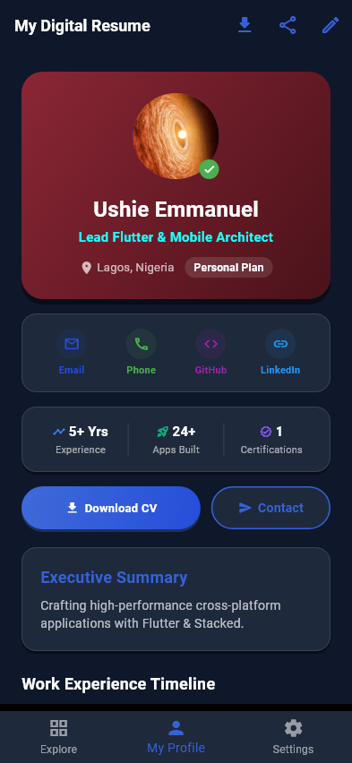
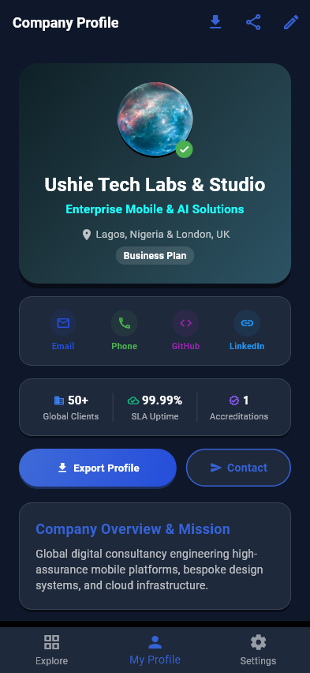
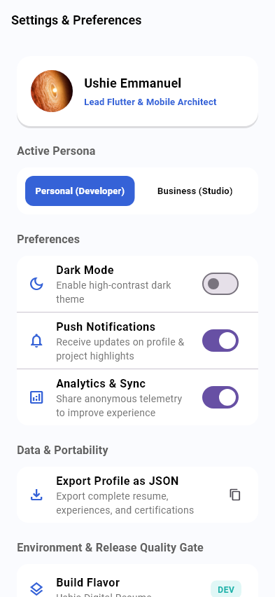
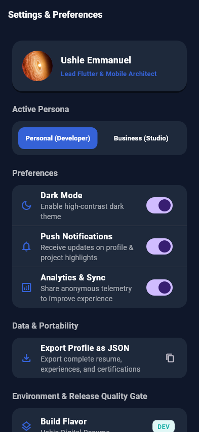
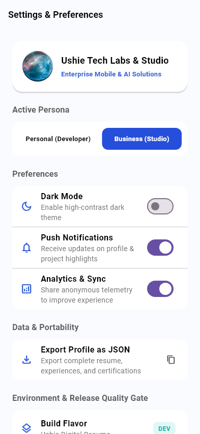
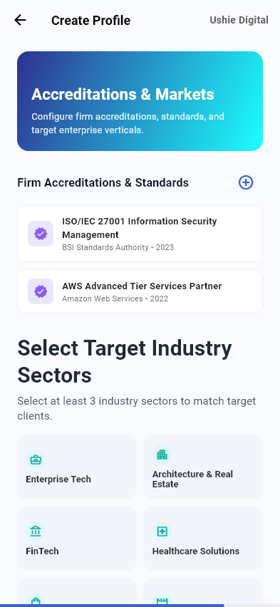

# Ushie Digital Resume

[](https://flutter.dev)
[](https://stacked.filledstacks.com)
[](https://supabase.com)
[](https://ushie-digital-resume.vercel.app)
[](LICENSE)

**Ushie Digital Resume** is an enterprise-grade, cross-platform digital resume, executive consultancy showcase, and portfolio platform built with **Flutter**, the **Stacked MVVM Architecture**, **Google Sans Design System**, and **Supabase**.

It supports a full **Dual-Persona System** (`Personal Developer` vs. `Business Enterprise`) with interactive project showcases, real-time architecture inspection modals, printable A4 resume dialogs, Markdown/JSON CV downloads, and multi-flavor continuous delivery (`dev`, `staging`, `production`).

---

## 📱 Visual Showcase & Golden Snapshot Gallery

Below are the pixel-perfect visual snapshots captured directly by the automated golden test suite:

### 1. Dual-Persona Executive Dashboard (Personal vs. Business)

The platform provides two distinct, purpose-built profile experiences: **Personal Developer** (individual engineer & architect portfolio) and **Business Studio** (enterprise digital agency & consultancy showcase). Both personas feature native Light and Dark themes:

<table width="100%">
  <tr>
    <th width="50%" align="center">👤 Personal Developer Persona</th>
    <th width="50%" align="center">🏢 Business Studio / Enterprise Persona</th>
  </tr>
  <tr>
    <td align="center">
      <br/><br/>
      <b>Personal Dashboard — Light Mode</b><br/>
      <sub>Individual bio, direct developer contact actions (GitHub, LinkedIn, Email), career achievements timeline, technical skills matrix, and printable A4 CV export.</sub>
    </td>
    <td align="center">
      <br/><br/>
      <b>Business Dashboard — Light Mode</b><br/>
      <sub>Enterprise studio branding, corporate KPI counters (1.2M+ users, 99.99% SLA), capability statement download, ISO-27001 / AWS accreditations, and B2B engagement channels.</sub>
    </td>
  </tr>
  <tr>
    <td align="center">
      <br/><br/>
      <b>Personal Dashboard — Dark Mode</b><br/>
      <sub>Midnight navy canvas (<code>#0F172A</code>), high-contrast experience cards, and luminescent status indicators optimized for OLED displays.</sub>
    </td>
    <td align="center">
      <br/><br/>
      <b>Business Dashboard — Dark Mode</b><br/>
      <sub>Executive dark palette highlighting enterprise telemetry milestones, corporate certifications, and high-assurance architecture highlights.</sub>
    </td>
  </tr>
</table>

---

### 2. Settings, Preferences & Reactive Theming

The Settings view provides instant 1-click persona switching, real-time dark mode toggling, push notification controls, data JSON backup, and multi-flavor diagnostics:

<table width="100%">
  <tr>
    <td align="center" width="33%">
      <br/><br/>
      <b>Settings — Light Mode</b><br/>
      <sub>Personal persona active, notification & telemetry toggles, and data export.</sub>
    </td>
    <td align="center" width="33%">
      <br/><br/>
      <b>Settings — Dark Mode</b><br/>
      <sub>Deep slate surface (<code>#1E293B</code>) elevation with instant dynamic re-theming.</sub>
    </td>
    <td align="center" width="33%">
      <br/><br/>
      <b>Settings — Business Active</b><br/>
      <sub>1-click switch showing active Enterprise Studio plan and corporate profile state.</sub>
    </td>
  </tr>
</table>

---

### 3. Onboarding & Interactive Project Catalog

<table width="100%">
  <tr>
    <td align="center" width="50%">
      <br/><br/>
      <b>Onboarding Step 1: Plan Selection</b><br/>
      <sub>Interactive dual-track choice between Personal Developer and Business Studio plans with 3D avatar carousel and 1-tap login sheet.</sub>
    </td>
    <td align="center" width="50%">
      <br/><br/>
      <b>Interactive Project Showcase (<code>ExploreView</code>)</b><br/>
      <sub>Categorized portfolio items, horizontal category chips, live interactive heart counters, and architecture inspection bottom sheets.</sub>
    </td>
  </tr>
  <tr>
    <td align="center" width="50%">
      <br/><br/>
      <b>Onboarding Step 4: Personal Interests (Compact Cards)</b><br/>
      <sub>Streamlined, compact category tiles (aspect ratio 1.85) featuring individual pursuits (Tech, Design, Travel, Music) with balanced vertical rhythm.</sub>
    </td>
    <td align="center" width="50%">
      <br/><br/>
      <b>Onboarding Step 4: Target Sectors (Compact Cards)</b><br/>
      <sub>Compact enterprise cards for digital consultancies (Enterprise Tech, FinTech, Healthcare, Real Estate) fitting cleanly within the viewport.</sub>
    </td>
  </tr>
</table>

---

### 4. Dual-Persona Comparison Matrix

| Feature / Dimension | 👤 Personal Developer Persona | 🏢 Business Studio Persona |
| :--- | :--- | :--- |
| **Target Audience** | Hiring managers, engineering leads, tech recruiters | Enterprise clients, procurement officers, CTOs |
| **Profile Focus** | Individual software engineer / mobile architect | Digital agency, dev studio, or enterprise consultancy |
| **Hero Title** | `Lead Flutter & Mobile Architect` | `Enterprise Mobile & AI Solutions` |
| **Headline Metrics** | Years of Experience, Open Source Repos, Apps Shipped | Client SLA Uptime (99.99%), Active Users (1.2M+), ISO Standards |
| **Primary Actions** | View Experience, Download CV, GitHub, LinkedIn | Download Capability Statement, Request Proposal, B2B Inquiries |
| **Timeline Content** | Career positions, employment history, engineering impact | Flagship client deliverables, enterprise overhauls, case studies |
| **Credentials** | Professional Certifications (Google Cloud, Meta) | Corporate Accreditations (ISO/IEC 27001, AWS Partner) |
| **Active Avatar** | Space Cadet / Developer 3D Avatar (`spacea.png`) | Enterprise Studio Emblem (`spacec.png`) |
| **Contact Channels** | Direct email, personal phone, GitHub, LinkedIn | Corporate business email, studio phone line, corporate LinkedIn |

---

## 🌙 Dark Mode & Dynamic Theming System

The application features a fully reactive, persistent **Dark Mode Engine**:

- **Reactive State Management**: Powered by `PreferencesService.darkModeListenable` connected directly to `MainApp` via `ValueListenableBuilder<bool>`.
- **Instant Global Updates**: Toggling Dark Mode in `SettingsView` immediately re-themes the entire application (`HomeView`, `ExploreView`, `SettingsView`, AppBars, BottomBars, BottomSheets, and Dialogs) without restarting or rebuilding the widget stack.
- **Persistent Cache**: Dark mode state is saved to `SharedPreferences` (`dark_mode` key) so returning users always boot into their preferred theme.
- **Carefully Crafted Palettes**:
  - **Dark Canvas**: Midnight navy slate (`#0F172A`)
  - **Surface Elevation**: Deep slate cards (`#1E293B`)
  - **Text Contrast**: Crisp `#FFFFFF` headers and `#E2E8F0` / `#94A3B8` body copy conforming to WCAG AA accessibility contrast guidelines.
  - **Interactive Elements**: Radiant accent blue (`#3562D7`) maintaining high legibility against dark backgrounds.

---

## 🏗️ Clean Entrypoint Architecture & IDE File Nesting

The entrypoint system under `lib/` has been consolidated to eliminate clutter and provide clear multi-environment flavor targeting. `lib/main_common.dart` has been removed in favor of a centralized bootstrap engine in `lib/main.dart`.

In VS Code and modern IDEs with file nesting enabled:
```
lib/
 ├── app.dart                   <-- Unified App Barrel & Stacked Configuration
 │   ├── app.bottomsheets.dart
 │   ├── app.dialogs.dart
 │   ├── app.locator.dart
 │   ├── app.router.dart
 │   └── app_config.dart
 └── main.dart                  <-- Core App Engine & Default Bootstrap
     ├── main_dev.dart          <-- Development Flavor (Debug logs enabled)
     ├── main_staging.dart      <-- Staging Flavor (Pre-production testing)
     └── main_prod.dart         <-- Production Flavor (Optimized release)
```

### File Nesting Configuration (`.vscode/settings.json`)
File nesting is pre-configured in `.vscode/settings.json` so that flavor files nest under `main.dart`, Stacked components nest under `app.dart`, and `pubspec.lock` nests under `pubspec.yaml`:
```json
{
  "explorer.fileNesting.enabled": true,
  "explorer.fileNesting.expand": false,
  "explorer.fileNesting.patterns": {
    "main.dart": "main_*.dart",
    "app.dart": "app.*.dart, app_*.dart",
    "pubspec.yaml": "pubspec.lock, pubspec_overrides.yaml, .packages, .flutter-plugins*"
  }
}
```

### How Bootstrapping Works
1. **`lib/main.dart`**: Declares `bootstrapApp(AppConfig config)`, initializes dependency injection via `setupLocator()`, configures dialog and bottomsheet UI, loads cached user preferences from `PreferencesService`, and mounts `MainApp`.
2. **`lib/main_dev.dart`**: Configures dev endpoints and calls `bootstrapApp(AppConfig.instance)`.
3. **`lib/main_staging.dart`**: Configures staging endpoints and calls `bootstrapApp(AppConfig.instance)`.
4. **`lib/main_prod.dart`**: Configures production endpoints and calls `bootstrapApp(AppConfig.instance)`.

---

## 🔍 Complete View & Page Breakdown

### 1. `StartupView` (Splash & Initialization)
- **Path**: `lib/ui/views/startup/startup_view.dart`
- **Purpose**: Displays the launch screen with animated branding, initializes asynchronous singletons (`PreferencesService`, `NavigationService`), verifies connection to Supabase backend, and presents an environment flavor badge (`DEV`, `STAGING`, `PRODUCTION`).
- **Routing**: Automatically routes to `HomeView` if onboarding is complete, or `OnboardingView` for fresh installs.

### 2. `OnboardingView` (5-Step Setup Wizard)
- **Path**: `lib/ui/views/onboarding/onboarding_view.dart`
- **Step 1 (Plan Selection)**: Choose between **Personal Developer Plan** (freelancer, architect, engineer) or **Business Enterprise Plan** (digital agency, studio, consultancy). Features a selectable 3D avatar gallery and 1-tap Account Login bottom sheet.
- **Step 2 (Profile / Firm Form)**: Collects full name, executive title, biography, contact email, phone, location, GitHub profile, LinkedIn URL, and portfolio site URL.
- **Step 3 (Skills & Competencies Matrix)**: Multi-select interactive pills (Flutter, Dart, Stacked MVVM, Supabase, Cloud Architecture, DevOps, UI/UX).
- **Step 4 (Interests & Target Sectors)**: Specialized focus tags for personal developers and target business verticals (FinTech, HealthTech, Enterprise SaaS, AI/ML).
- **Step 5 (Visual Review & Finalization)**: Summary preview card, visual compliance score indicator, and one-tap completion trigger.

### 3. `HomeView` (Executive Resume Dashboard)
- **Path**: `lib/ui/views/home/home_view.dart`
- **Dual-Persona Profile Header**: Displays user avatar, full name, professional title, location badge, and executive summary bio.
- **Direct Contact Quick Actions**: One-click action buttons to launch Email (`mailto:`), Phone (`tel:`), GitHub (`url_launcher`), LinkedIn, and Portfolio Web.
- **Career Timeline / Work Experience**: Reverse-chronological experience list with company name, role, dates, description, and bulleted achievements.
- **Certifications Showcase**: Verified certificates with issuer tags, issue year, and credential verification links.
- **Skills Matrix & Hobbies**: Visual competency tags and personal interest chips.
- **Resume Export & Download**:
  - **A4 Printable Preview Dialog**: Full-screen modal simulating an A4 printed curriculum vitae.
  - **Markdown Export**: One-tap export to download the complete resume as a formatted `.md` file.

### 4. `ExploreView` (Interactive Project Showcase)
- **Path**: `lib/ui/views/explore/explore_view.dart`
- **Live Search & Filter**: Real-time search query filtering and horizontal category chips (`All`, `Mobile`, `Web`, `Architecture`, `Enterprise`).
- **Showcase Project Cards**: Banner images, title, category badge, description, metric counters (e.g. *99.9% Crash-free*, *100k+ Users*), and tech stack pills.
- **Interactive Heart Counter**: Tap to like projects with real-time UI count increments.
- **Architecture Inspection Modal**: Tap "View Architecture" to open a bottom sheet showing system design, state management approach, backend integrations, and test coverage metrics.

### 5. `SettingsView` (Preferences & Flavor Diagnostics)
- **Path**: `lib/ui/views/settings/settings_view.dart`
- **Persona Quick Switcher**: 1-click toggle between Personal and Business profiles.
- **Display Preferences**: Dark Mode theme toggle.
- **System Controls**: Push notification preferences and crash telemetry opt-in.
- **Data Management**: Export local profile data as JSON for backup or migration.
- **Environment Diagnostics**: Active flavor banner displaying current environment (`dev`, `staging`, `production`), API base URL, and build version.

---

## 🌐 Multi-Tier Deployment Lifecycle & Environments

The project enforces a strict 3-tier deployment lifecycle visible directly on GitHub:

```
[Feature / Chore Branch] ──(Push/PR)──> 🧪 PREVIEW Deployment (Dev Flavor)
                                               │
                                       (PR Review + CI Gates)
                                               ▼
['main' Baseline Branch] ──(Merge)────> 🏗️ STAGING Deployment (Staging Flavor)
                                               │
                                       (QA Verification + Sign-off)
                                               ▼
[Promote to Production]  ──(Dispatch)─> 🌟 PRODUCTION Release (Final Phase)
```

1. **🧪 Preview Environment (Any Branch / PR)**:
   - Every feature, fix, or task branch automatically builds and deploys to an ephemeral Vercel preview with the `dev` flavor (`lib/main_dev.dart`).
2. **🏗️ Staging Environment (`main` Branch)**:
   - **`main` is the Staging baseline.** Pull requests merged into `main` automatically build and deploy to [`https://staging-ushie-digital-resume.vercel.app`](https://staging-ushie-digital-resume.vercel.app) with the `staging` flavor (`lib/main_staging.dart`).
3. **🌟 Production Environment (Final Phase Promotion)**:
   - **Production is the absolute last phase of anything.** Code is never deployed to production automatically. Releases are promoted only from `main` via the GitHub Actions **Promote to Production** workflow or official release tags (`v*.*.*`), protected by GitHub Environment manual approval gates.

- **Live Production URL**: [`https://ushie-digital-resume.vercel.app`](https://ushie-digital-resume.vercel.app)
- **Live Staging URL**: [`https://staging-ushie-digital-resume.vercel.app`](https://staging-ushie-digital-resume.vercel.app)
- **Live Supabase Endpoint**: `https://qoioeymizjtlfoqmeaut.supabase.co` (`eu-west-1`)

> 📖 **Full Architectural Guides**:
> - [Branching & Multi-Tier Deployment Lifecycle Guide](docs/BRANCH_AND_DEPLOYMENT_LIFECYCLE.md)
> - [GitHub Branch Protection & Ruleset Setup Guide](docs/BRANCH_PROTECTION_GUIDE.md)

---

## 🛠️ Build & Flavor Execution Commands

Run the application targeting specific flavors:

```bash
# 1. Default (Dev configuration)
flutter run -t lib/main.dart

# 2. Development Flavor
flutter run -t lib/main_dev.dart --flavor dev

# 3. Staging Flavor
flutter run -t lib/main_staging.dart --flavor staging

# 4. Production Flavor
flutter run -t lib/main_prod.dart --flavor prod
```

---

## 🧪 Quality Gate & Automated Testing

All unit tests and golden visual tests are verified before deployment:

```bash
# Analyze static code quality (0 issues required)
flutter analyze

# Execute full automated test suite & golden snapshots
flutter test
```

### Verified Test Suite (11 Golden Snapshots + 12 Unit Tests)
- `OnboardingView - Step 1 Plan Selection` (Golden) — **PASSED**
- `OnboardingView - Step 4 Interest Selection` (Golden) — **PASSED**
- `OnboardingView - Step 4 Target Industry Sectors (Business)` (Golden) — **PASSED**
- `ExploreView - Project Showcase` (Golden) — **PASSED**
- `HomeView - Personal Developer Dashboard (Light Mode)` (Golden) — **PASSED**
- `HomeView - Personal Developer Dashboard (Dark Mode)` (Golden) — **PASSED**
- `HomeView - Business Enterprise Dashboard (Light Mode)` (Golden) — **PASSED**
- `HomeView - Business Enterprise Dashboard (Dark Mode)` (Golden) — **PASSED**
- `SettingsView - Light Mode Preferences` (Golden) — **PASSED**
- `SettingsView - Dark Mode Preferences` (Golden) — **PASSED**
- `SettingsView - Business Persona Active` (Golden) — **PASSED**
- `ExploreViewModelTest` (5 Unit Tests) — **PASSED**
- `HomeViewModelTest` (4 Unit Tests) — **PASSED**
- `NoticeSheetModelTest` (2 Unit Tests) — **PASSED**
- `InfoAlertDialogModelTest` (1 Unit Test) — **PASSED**
