# 🚀 Branching & Multi-Tier Deployment Lifecycle Guide

This document establishes the official **Branching, Environment, and Deployment Lifecycle** for `Project_Resume`.

---

## 🧭 The Core Principles

1. **Explicit Branch Creation Protocol**:
   - **Before creating or checking out any new branch**, the developer / AI assistant **must first inform or ask the user** and confirm the exact branch name and task scope.
   - No silent branch creation or direct commits to `main`.
2. **Tier 1: Feature Branches &rarr; Preview Deployments**:
   - Any branch created (e.g., `feature/*`, `fix/*`, `chore/*`) and all Pull Requests automatically deploy to the **Preview** environment on Vercel with ephemeral preview links and execute CI quality checks (`flutter analyze` and `flutter test`).
3. **Tier 2: The `main` Branch IS the Staging Baseline**:
   - The `main` branch is exclusively dedicated to **Staging** (`staging-ushie-digital-resume.vercel.app`).
   - When a Pull Request is approved and merged into `main`, it automatically builds and deploys to **Staging** using the Staging flavor (`lib/main_staging.dart`).
   - **`main` does NOT deploy directly to Production.**
4. **Tier 3: Production is the Final Phase**:
   - **Production is the absolute last phase of anything.**
   - Only from `main`—after Staging has been fully verified and tested—can code be promoted to **Production** (`https://ushie-digital-resume.vercel.app`).
   - Production promotion requires an intentional manual trigger (`workflow_dispatch` promotion button) or an official release tag (`v*.*.*`), protected by GitHub Environment Approval gates.

---

## 📊 Deployment Pipeline Architecture

```mermaid
flowchart TD
    subgraph Development ["1. Development Phase (Any Branch)"]
        UserPrompt["User Prompt / Task Request"] --> BranchConsent["Ask / Confirm Branch Name with User"]
        BranchConsent --> FeatureBranch["Create Feature Branch<br/>(e.g., feature/xyz, chore/abc)"]
        FeatureBranch --> LocalHook["Local Pre-Push Hook Guard<br/>(Blocks direct pushes to main)"]
        LocalHook --> PushFeature["Push to Origin Feature Branch"]
        PushFeature --> PreviewDeploy["CI + Deploy to PREVIEW<br/>(Vercel Preview URL)"]
    end

    subgraph StagingPhase ["2. Staging Phase ('main' Branch)"]
        PreviewDeploy --> OpenPR["Open Pull Request into 'main'"]
        OpenPR --> StatusChecks["CI Quality Gates<br/>(flutter analyze + 22 tests pass)"]
        StatusChecks --> MergeMain["Merge PR into 'main'"]
        MergeMain --> StagingDeploy["Auto-Deploy to STAGING<br/>(staging-ushie-digital-resume.vercel.app)"]
    end

    subgraph ProductionPhase ["3. Production Phase (Final Phase)"]
        StagingDeploy --> ManualQA["Stakeholder & QA Verification on Staging"]
        ManualQA --> PromotionGate{"Promote to Production?"}
        PromotionGate -- "Yes" --> GitHubAction["Trigger 'Promote to Production' Button<br/>OR Push Release Tag (v1.0.0)"]
        GitHubAction --> RequiredReview["GitHub Environment Protection Gate<br/>(Required Manual Reviewer Approval)"]
        RequiredReview --> ProdDeploy["Deploy to PRODUCTION<br/>(ushie-digital-resume.vercel.app)"]
    end

    style Development fill:#EEF2FF,stroke:#6366F1,stroke-width:2px;
    style StagingPhase fill:#FEF3C7,stroke:#F59E0B,stroke-width:2px;
    style ProductionPhase fill:#DCFCE7,stroke:#10B981,stroke-width:2px;
```



---

## 🌐 GitHub Environments & Visibility

GitHub Actions is configured with explicit GitHub Environments so that every stage is visible in the GitHub UI:

| Environment | Trigger Event | Target Flavor & File | Live URL / Scope | Protection Level |
| :--- | :--- | :--- | :--- | :--- |
| **`preview`** | Push to any branch / Pull Request | Dev Flavor (`lib/main_dev.dart`) | Ephemeral Vercel Preview URL | Automated CI quality checks |
| **`staging`** | Push or merge into `main` | Staging Flavor (`lib/main_staging.dart`) | [`https://staging-ushie-digital-resume.vercel.app`](https://staging-ushie-digital-resume.vercel.app) | PR Review + Status Checks required |
| **`production`** | Manual Dispatch / Release Tag `v*.*.*` | Prod Flavor (`lib/main_prod.dart`) | [`https://ushie-digital-resume.vercel.app`](https://ushie-digital-resume.vercel.app) | **Manual Reviewer Approval Gate** |

### Where to See This on GitHub:
1. **Repository Homepage (Right Sidebar)**:
   - Under **Environments**, GitHub displays active deployment badges for `preview`, `staging`, and `production` with real-time status and deployment timestamps.
2. **Pull Request Timeline**:
   - Every PR displays the **Preview** environment deployment card with a clickable direct URL to review changes before merging.
3. **Actions &rarr; Deployments Tab**:
   - Complete audit trail of every deployment across all three tiers.

---

## ⚙️ How to Configure GitHub Environment Protection Rules

To enforce that Production cannot be deployed without your personal sign-off on GitHub:

1. Navigate to:
   👉 **[https://github.com/Ushie-E/Project_Resume/settings/environments](https://github.com/Ushie-E/Project_Resume/settings/environments)**
2. Click on the **`production`** environment (it is created automatically after the first workflow run, or click **New environment** &rarr; name it `production`).
3. Under **Deployment protection rules**:
   - ✅ **Check: Required reviewers** &rarr; Add your GitHub username (`Ushie-E`).
   - ✅ **Check: Deployment branches** &rarr; Select **Selected branches** and add `main` (ensuring production can ONLY be deployed from code existing on `main`).
4. Click **Save protection rules**.

Now, whenever anyone clicks "Promote to Production", GitHub will send you an approval notification, and the release job will wait until you click **Approve and deploy**!

---

## 🕹️ How to Promote Staging to Production (One-Click)

When changes on `main` have been tested on Staging and are ready for release:

1. Go to the **Actions** tab on GitHub:
   👉 **[https://github.com/Ushie-E/Project_Resume/actions/workflows/deploy_vercel.yml](https://github.com/Ushie-E/Project_Resume/actions/workflows/deploy_vercel.yml)**
2. In the blue banner, click the **Run workflow** button.
3. Keep **Use workflow from**: `Branch: main`.
4. Select **Deployment Target Environment**: `production`.
5. Click **Run workflow**.
6. If Environment Protection is enabled, click **Review deployments** &rarr; **Approve and deploy**.

---

## 🔒 Branch Creation & Local Machine Guard Checklist

Before beginning any development task, follow this exact checklist:

- [ ] **Step 1: Ask / Inform the User**:
  - Propose the branch name (e.g., `feature/analytics-module`, `chore/theme-tokens`).
  - Confirm the scope with the user.
- [ ] **Step 2: Ensure Local Pre-Push Hook is Active**:
  ```powershell
  git config core.hooksPath .githooks
  ```
- [ ] **Step 3: Branch from Up-to-Date `main`**:
  ```bash
  git checkout main
  git pull origin main
  git checkout -b <confirmed-branch-name>
  ```
- [ ] **Step 4: Push to Origin for Preview Verification**:
  ```bash
  git push -u origin <confirmed-branch-name>
  ```
- [ ] **Step 5: PR into `main` for Staging Deployment**:
  - Open PR &rarr; CI checks pass &rarr; Merge into `main` &rarr; Staging automatically deploys.
- [ ] **Step 6: Verify on Staging & Promote to Production**.
